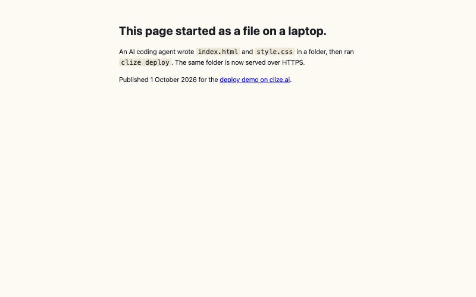

# 02 · From a local HTML folder to a real HTTPS site, then your own domain and inbox

**What this shows:** the folder in `site/` (three files an agent could have written) goes online at `https://<slug>.clize.app`, then onto a domain you own, with a mailbox on that domain.
**Live result of the recorded run:** [clize-demo.clize.app](https://clize-demo.clize.app/) — Clize's own demo, still online.
**Recorded:** 1 October 2026, Clize CLI 0.47.3, Node 22.22, macOS. Write-up: [clize.ai/sites/host-html-file/#real-run](https://clize.ai/sites/host-html-file/#real-run).

## 1 · Local folder → HTTPS

```console
$ ls site/
404.html  index.html  style.css

$ clize build site check ./site               # free, local, nothing uploaded
2 page(s) · 0 error(s) · 1 warning(s)
  ⚠ /404.html: no meta description — results will show a snippet you did not write
✓ no errors

$ clize claim clize-demo                      # skip if you did example 01 (18 s there)
$ clize init --handle clize-demo
$ clize deploy ./site                         # 15 s
{ "host": "clize-demo.clize.app", "url": "https://clize-demo.clize.app", "files": 3,
  "notFound": "404-page (auto)",
  "geo": { "sitemap": "https://clize-demo.clize.app/sitemap.xml", "llms": "…/llms.txt", "robots": "…/robots.txt" },
  "message": "Live at https://clize-demo.clize.app (3 files: 3 KV + 0 R2; …; TLS automatic)" }
```



Checked from outside right after:

```console
$ curl -sI https://clize-demo.clize.app/          # 200 in 0.17 s
$ curl -sI http://clize-demo.clize.app/           # 301 → https://clize-demo.clize.app/
$ curl -sI https://clize-demo.clize.app/nope      # 404 — our 404.html, not a soft 200
$ curl -sI https://clize-demo.clize.app/sitemap.xml   # 200; llms.txt and robots.txt too (robots allows the AI crawlers)
```

**What looked wrong but was not:** the deploy printed `"rerouted": "Deployed to the domain's real project \"default\" (stale checkout \"clize-demo\" ignored)"`. In a fresh folder, `claim` filed the handle under the account's default project while `init` wrote a new project name into `clize.json`. Deploy follows the domain, so nothing broke.

## 2 · Your own domain

A deploy target is a **free handle or a whole domain in your account**. Two ways in:

```console
$ clize domain search yourname --tld com      # free: availability + registration and renewal price
[ { "domain": "clize-demo-agent.com", "available": true, "registrationCost": 12.55, "renewalCost": 12.55, "registrar": "cloudflare" } ]
$ clize domain buy yourname.com               # a quote; nothing is bought
$ clize domain buy yourname.com --confirm     # buys it from your balance ($12.55 for a .com on 2026-10-01)

$ clize domain import yourname.de             # a domain you already own elsewhere: prints the nameservers
                                              # to set at your registrar (.de, .fr, .es, .jp, .kr, .com.br, .uk, .eu
                                              # are not registrable through Clize — import those)
$ clize deploy ./site --domain yourname.com
$ clize domain check yourname.com             # six layers: registry delegation, zone, binding, content,
                                              # AI-crawler policy at the edge, http→https
```

The recorded run did **not** buy a domain (it would have cost $12.55). The check below is on a domain Clize already runs this way:

```console
$ clize domain check getworkflowtemplates.com
✅ healthy: delegation / zone / binding all fine
delegation ✓ registry NS on Cloudflare · zone ✓ active · binding ✓ worker clize-handle-site
content ✓ · aiBots ✓ not blocked · https ✓ 301 → https://getworkflowtemplates.com/
```

**Boundaries we hit:**
- `clize deploy ./site --domain demo.getworkflowtemplates.com` → `403 … is not yours or not claimed`. A subdomain of a domain you own is not a separate deploy target today.
- Names bought through Clize are registered with Clize's registrant contact at the registrar (Cloudflare or Vercel). If you need to be the registrant of record, register the name yourself and `clize domain import` it.

## 3 · A mailbox on the domain

```console
$ clize email address add demo@getworkflowtemplates.com     # 11 s; writes MX + SPF
{ "address": "demo@getworkflowtemplates.com", "status": "active", "inboundReady": true }
# MX was visible on dns.google ~20 s later
```

A test message sent 31 s after opening the mailbox **never arrived**; the retry four minutes later arrived in about 5 s. Give a new mailbox a minute. Outbound from a domain leaves as `you@mail.yourdomain.com` (Cloudflare publishes the DKIM key and a DMARC `p=reject` record for that sending subdomain); your address is the Reply-To. A DMARC policy for the apex is not written for you.

## Cost and limits

- Steps 1 and 3: **$0**. Step 2: the domain price, quoted before anything is charged.
- Free tier: 20 deploys a day, 500 MB per site (5 GB after any top-up), files up to ~90 MB.
- Deploy only adds or overwrites; `--prune` removes live paths missing from the folder.
